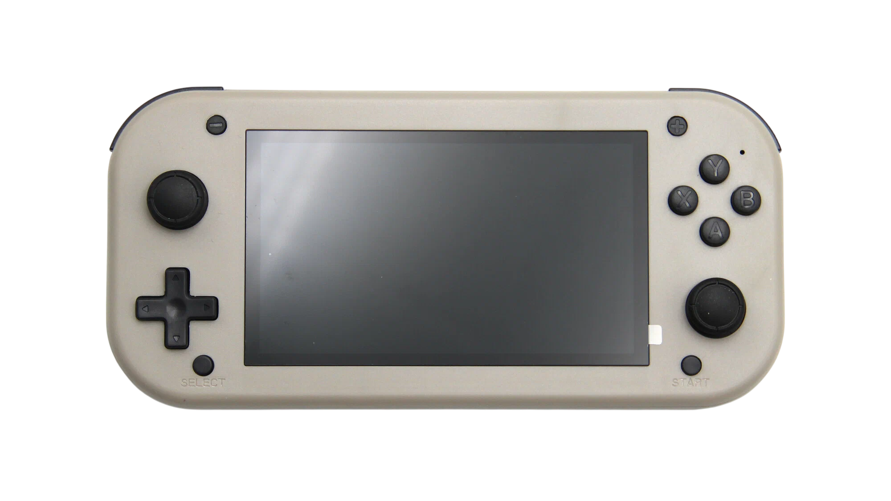

# SJGAM M17 и с чем её едят
Утилиты для SJGAM M17 и всякие справки (написано под ревизию W12-V04).

## Оглавление

* [Тех. характеристики консоли](#тех-характеристики-консоли)
* [Структура встроенной памяти eMMC](#структура-встроенной-памяти-emmc)
* [Режим "LOADER"](#режим-loader)
* [Режим "MASKROM"](#режим-maskrom)
* [Что такое режим "MASKROM"?](#что-такое-режим-maskrom)
* [Что такое режим "LOADER"?](#что-такое-режим-loader)
* [Версии (ядра и прочего)](#версии-ядра-и-прочего)
* [Состояние Buildroot](#состояние-buildroot)
* [Состояние ядра](#состояние-ядра)
* [Состояние древа](#состояние-древа)
* [Изменение работы стиков](#изменение-работы-стиков)
* [Изменение яркости экрана](#изменение-яркости-экрана)
* [Определение наушников](#определение-наушников)
* [Какие то знакомые больно стики, откуда же они?](#какие-то-знакомые-больно-стики-откуда-же-они)

## Тех. характеристики консоли:

- **Процессор:** Rockchip RK3126C - 4 ядра Cortex-A7 (работает только в 1.2 ГГц) - видеоядро Mali-400 MP2 (работает только в 480 МГц).
- **Оперативная память:** 256MB DDR3 SDRAM - Samsung K4B1G0846F-HCH9 - 2 чипа по 128MB, работающих в 480 МГц (вплоть до 667 МГц, но напряжения не хватает, консоль зависает при насильном выставлении МГц).
- **Встроенная память (eMMC):** Toshiba THGBMDG5D1LBAIL - 4 GB.
- **Дисплейный модуль:** матрица NoName GV043WXY002LA0703SW - 40 pin FPC - 480x272 - 4.3", соотношение сторон - 16:9.06.
- **Аккумулятор:** Li-Polymer LB 405267 - 2000mAh - 3.85V - 7.7Wh.
- **Контроллер питания:** LY4057.
- **Аудиоусилитель:** MIX2018.
- **Порты:** USB Type-C (OTG включен в device-tree (на uboot и на boot), но на порт не разведен (не особо он там и нужен), TRRS 3.5mm (Mini Jack в простонародии, вывод звука и вход наушников) и слот microSDXC (пока не известен макс. объем, который эта консоль примет. Теоретически - 2 ТБ, так как поддерживается адресация стандарта SD 3.0).
- **Управление:** механическое (кнопки громкости + / - , кнопки start / select, тумблер состояния консоли On / Off, два аналоговых стика с кнопками R3 / L3, шифты L1 / R1 / L2 / R2, кнопки D-Pad и A / B / Y / X.
- **Вывод звука:** 1 плёночный динамик с неизвестными характеристиками, по моему 8 Ом.
- **I²C контроллер:** NoName без маркировки.

## Структура встроенной памяти eMMC:

| № | Раздел | Смещение (LBA) | Размер (HEX) | Размер (МБ) |
|:---:|:--- |:---:|:---:|:---:|
| 01 | **uboot** | `0x00004000` | `0x00002000` | **4 MB** |
| 02 | **trust** | `0x00006000` | `0x00002000` | **4 MB** |
| 03 | **misc** | `0x00008000` | `0x00002000` | **4 MB** |
| 04 | **boot** | `0x0000a000` | `0x00010000` | **32 MB** |
| 05 | **recovery** | `0x0001a000` | `0x00010000` | **32 MB** |
| 06 | **backup** | `0x0002a000` | `0x00010000` | **32 MB** |
| 07 | **oem** | `0x0003a000` | `0x000c8000` | **400 MB** |
| 08 | **rootfs** | `0x00102000` | `0x00100000` | **512 MB** |
| 09 | **userdata** | `0x00202000` | `0x0055dfdf` | **~2747 MB** |

- uboot и trust: Типовые загрузчики RockChip.
- - trust: содержит разные ключи и подписи, которые не менять, не корректировать не нужно, оставляем как есть.
- - uboot: отвечает за инициализацию начинки (RAM, eMMC и т.п.). Имеет device-tree, который изменять не нужно, так как все основные функции содержатся в device-tree из boot.

- misc, backup, oem, recovery: разделы пустышки или файлопомойки, которые роли в работе особо не играют.
- - misc: не открывается ничем, пустой полностью, просто размечается как раздел, изменений в нём не происходит.
- - backup: такой же случай, как с misc.
- - recovery: содержит всё, что в boot, содержит device-tree, но и имеет ramdisk с buildroot который запускает только em_ui.sh с флешки, не используется, само рекавери никак не запускается, тоже просто ради "галочки".
- - oem: содержит файлы некого test mode китайской buildroot системы (грузит видео и аудио с раздела для проверки), раздел также не нужен.

- boot: бут как в Android, содержит device-tree, ramdisk отсутствует! Грузит систему напрямую (rootfs). Если вставлена карта памяти - все равно грузится rootfs, но rootfs передает управление init скрипту, который грузит лаунчер на карте памяти (em_ui.sh), если карты памяти нет, грузится /usr/bin/game (minigui), китайский GUI с играми, в качестве эмулятора выступает китайский кастрированый билд RetroArch.

- rootfs: содержит систему Linux, собранную через SDK Rockchip Buildroot 2018.02-rc3-01346-gd8cef2a-dirty. SquashFS. Логика запуска в /etc/init.d/.
- userdata: r/w, в него скидываются всякие конфиги ретроарча с rootfs, без этого раздела запуска не будет.

## Режим "LOADER"

Вход осуществляется следующим образом: выключаем консоль, вставляем USB Type-C кабель в консоль и в ПК/Ноутбук, зажимаем кнопку **-** на консоли и включаем её. 

## Режим "MASKROM"

Вход осуществляется двумя способами: 

- 1: Выключаем консоль, разбираем, отключаем аккумулятор и динамик, переводим выключатель в позицию **On**, вставляем USB Type-C кабель в консоль, разьем USB держим возле ПК/Ноутбука (не втыкаем), замыкаем [Test Point](Photos/testpoint.png) и втыкаем кабель. Вы в MASKROM. Также, как я, можно вывести кнопку для MASKROM (убедитесь, что кнопка имеет сопротивление в районе 0.1–1 Ома и имелись максимально короткие провода. Выбирайте места рядом с тест поинтом. Например под шифтами L).

- 2: Переход из под режима LOADER через кнопку в условном RKDevTool.

## Что такое режим "MASKROM"?

- Это самый низкоуровневый режим. Он зашит прямо в железо процессора и его невозможно стереть или повредить.
  
- Как это работает: При включении консоли процессор первым делом ищет загрузчик (u-boot) в eMMC. Если память пуста, повреждена или специально замкнут [Test Point](Photos/testpoint.png), процессор не находит код для запуска и переходит в MASKROM.
  
- Зачем нужен: Это «режим последней надежды». В нем устройство определяется компьютером как Rockusb Device, и через специальные утилиты (типа RKDevTool, RKDevelopTool или RKAndroidTool) можно залить прошивку на абсолютно чистую память.

## Что такое режим "LOADER"?

- Это штатный режим прошивки, когда первичный загрузчик уже работает, но он не грузит систему, а ждет команд от компьютера.

- Как это работает: В этом режиме работает микропрограмма-посредник (miniloader или uboot), которая умеет общаться с USB-портом и записывать данные в нужные разделы памяти.

- Отличие от MaskRom: В Loader устройство попадает, если загрузчик в памяти исправен.

## Версии (ядра и прочего):
```
Linux rk3126c 4.4.179 (sunchip@sunchip-PowerEdge-R740) (gcc version 6.3.1 20170404 (Linaro GCC 6.3-2017.05) ) #1807 SMP Tue Jul 16 14:53:21 CST 2024 armv7l GNU/Linux
```
Да... gcc староват, но можно и под него программы найти (ну и собрать свои).

## Состояние Buildroot:

Собран он сносно, но и имеет ~100 файлов отборного китайского хлама.

## Состояние ядра:

Собрано также сносно.

## Состояние древа:

Собрано вполне неплохо, см. [deconfig](https://github.com/pictonys/SJGAM-M17/blob/main/Stock%20Kernel%20Deconfig%20(4.4.179)/M17_W12-V04_KERNEL_DECONFIG), вытащенный через extract-ikconfig.

## Изменение работы стиков:

- Работа стиков в режиме стиков включается командой:

```
echo 6 > /sys/devices/platform/key_mode.0/key_mode
```

- Работа стиков в режиме дублирования крестовины и ABYX включается командой:

```
echo 0 > /sys/devices/platform/key_mode.0/key_mode
```

- Наличие других значений неизвестно.

## Изменение яркости экрана:

- Имеется порог значений от 0 до 8000, 0 - 100%, 8000 - 1%. Значения больше 8000 - 0%.

- Значения вписываются следующим образом:

```
echo 8000 > /dev/gpio-pwm
```

## Определение наушников:

- Имеется файл состояния наушников.

- Его проверка осуществляется командой:

```
cat /sys/devices/virtual/switch/h2w/state
```

- Объяснение значений:
- - 0 — Гарнитура НЕ подключена (состояние "выключено" или "вне разъёма").
- - 1 — Подключена гарнитура с микрофоном (четырёхконтактный штекер TRRS).
- - 2 — Подключены наушники без микрофона (трёхконтактный штекер TRS).
 
За помощь с определением значений - спасибо [IIDarknessII](https://4pda.to/forum/index.php?showuser=2998377)!

## Какие то знакомые больно стики, откуда же они?:

- Стики представляют из себя китайское поделие на стики с первого Nintendo Switch, только в оригинале они на шлейфе.
